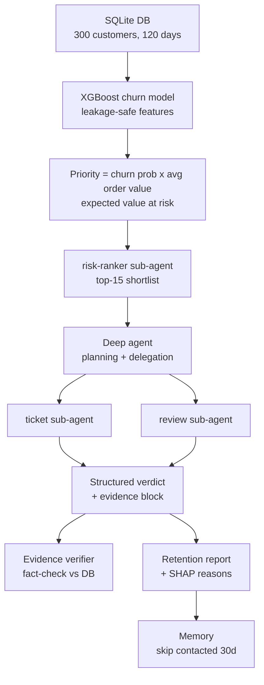

# Customer Churn Early-Warning Agent


A hybrid **ML + multi-agent** system for a quick-commerce platform (Blinkit / Zepto style)
that predicts which customers are about to quietly leave, investigates *why* using
specialised sub-agents, verifies every claim against the database, and hands a retention
team a prioritised, explainable worklist — then remembers who it already contacted.

> **One line:** an XGBoost model ranks 300 customers by *risk × value*; a deep agent
> investigates the top slice through three single-purpose sub-agents; every fact the agent
> cites is machine-verified; the output is a business-ready report — measured honestly on
> known ground truth.

---

## The problem

On quick-commerce apps, valuable customers churn **silently**. Someone who ordered a dozen
times and left 5-star reviews simply stops — no complaint, no cancellation notice. They
just switch to a rival app. By the time anyone notices, they are gone. But **the data
changed before they left**: cancelled orders, unresolved tickets, falling ratings, a
declining login trend.

Detecting this early — while a coupon or a call can still win them back — is worth
automating. This project does the detection *and* the prioritisation *and* the explanation.

---

## Architecture



**The key idea:** the ML model is cheap and scores *everyone*; the agent is expensive and
only investigates the *top priorities*. ML predicts, the agent investigates, and **both feed
the final decision** — the agent even *overrides* the model when the evidence is benign.

---

## Results

Measured on a held-out test set and against planted ground truth (the simulator knows
exactly who churned):

| Metric | Value | What it means |
|---|---|---|
| **Model ROC-AUC** | **0.731** | Honest population ranking on leakage-safe features (not a suspicious 0.99) |
| **Precision @ top-15** | **1.00** | Every customer the agent escalated is a genuine churner |
| **Evidence fidelity** | **100%** | Every fact the agent cited matches the database exactly |
| **Recall** | 0.22 | 15 of 68 churners — *intentionally* capped by the investigation budget (see below) |

**On recall — this is a design choice, not a weakness.** It is a two-stage *triage* system:
the model ranks the full population (AUC 0.731); the agent deeply investigates only the
top-15 by priority, achieving 100% precision. You raise `top_n` to trade cost for coverage.
Optimising for precision on high-value customers is deliberate — a wasted coupon is cheap,
but a false "call this VIP" escalation erodes the team's trust in the system.

---

## How it works

1. **Synthetic data with *causal* churn.** A standalone simulator builds a realistic SQLite
   database (users, orders, audit log, tickets, reviews). Crucially, churn is **caused by
   behaviour** — hidden drivers (delivery pain, support pain, pickiness) shape both the
   customer's bad experiences *and* their churn probability. This gives an ML model genuine
   signal to learn, instead of a random coin-flip.

2. **XGBoost churn model.** Trained on **leakage-safe** features — rates and averages
   (cancellation rate, unresolved-ticket rate, review ratings, order value), never raw
   counts (which leak the "they stopped" label).

3. **Value-weighted priority.** `priority = churn_probability × avg_order_value`
   ("expected value at risk"), so high-value customers at risk rise to the top.

4. **Deep agent + three sub-agents.** A planning supervisor delegates to single-purpose
   sub-agents (risk-ranker, ticket-analyst, review-analyst), gathers evidence, and produces
   a structured verdict per customer. It **moderates** the model — downgrading a
   high-probability customer to LOW when the evidence is benign.

5. **Evidence verifier.** Independently re-queries the database to fact-check every number
   the agent cited — catching any hallucination before a human sees it.

6. **SHAP explainability.** Each customer's report row shows *why* the model flagged them
   ("high cancellation rate", "unresolved support tickets") — and this converges with the
   agent's independent evidence.

7. **Retention report + memory.** A business-ready markdown report (priority, risk %, ML
   reason, action, evidence). A contact log ensures the next run does **not** re-flag
   customers already contacted in the last 30 days.

---

## Key engineering decisions

These are the decisions that separate this from a tutorial project — each was *measured*,
not assumed:

- **Leakage awareness.** Recent-activity features would give a fake ~0.99 AUC (they *are*
  the label). Used rates/averages instead → honest 0.731. A believable churn model, not a
  suspicious one.

- **SHAP-driven feature selection, by testing.** SHAP flagged two suspicious features.
  Tested both: removing `tenure_days` held AUC (0.728 → 0.731) so it was overfit noise —
  **dropped it**; removing `avg_order_value` dropped AUC to 0.656 so it carried real signal —
  **kept it**. Conclusions earned by measurement.

- **Confound awareness.** Raw ticket *count* was reversed (churned users had fewer, because
  they left earlier and had less activity). Used **rates**, not counts, to avoid the volume
  confound.

- **The critic agent that honestly *hurt*.** Added a skeptical 4th reviewer for multi-agent
  debate — and measured it. On the already-precise top-15 it *reduced recall* by downgrading
  two genuine churners with reasonable-sounding rules ("no complaints = fine"), because churn
  here is also delivery-driven. **Lesson: a critic only pays off on a candidate set that
  actually contains false positives.** Measured, not assumed.

- **Provider as config, not code.** A single `get_model()` factory switches between Vertex AI
  (Gemini), Groq (Llama), and the Gemini Developer API by editing one env var. (Also surfaced
  a real finding: Groq's Llama-70B emitted malformed tool calls that broke the agent harness,
  while Gemini handled them — a genuine model/harness compatibility lesson.)

- **Safety by data minimisation.** The agent's tools use a **read-only** database connection
  and only ever return the fields needed for a decision — customer phone/email never reach
  the LLM in the first place.

---

## Considered and rejected

Knowing what *not* to build is part of the design. Each of these is real technology — just
not the right fit for *this* problem:

| Rejected | Why |
|---|---|
| **RAG** | Data is structured — retrieval is SQL (exact, free). No document corpus to embed. |
| **Knowledge graph** | Relationships are one foreign-key hop deep; SQL answers everything. |
| **A2A protocol** | All agents live in one system; A2A is for cross-organisation agent interop. |
| **Kubernetes** | A weekly batch job over one SQLite file. A container + a schedule is right-sized. |
| **Fine-tuning** | No data volume and no measured prompting failure. Order is prompt → tools → fine-tune. |
| **Fancy UI** | The product is decision quality — the metrics and the report, not a dashboard. |

---

## Tech stack

- **Python 3.12** + [`uv`](https://github.com/astral-sh/uv) (project/package manager)
- **Agent harness:** `deepagents` (LangChain / LangGraph) — planning, sub-agents, structured output
- **LLM:** Gemini via Vertex AI (swappable to Groq / Gemini API via one env var)
- **ML:** XGBoost, scikit-learn, SHAP, pandas
- **Data:** SQLite (standard-library simulator, zero external services)

---

## Project structure

| File | Role |
|---|---|
| `quick_commerce_sim.py` | Synthetic data simulator (causal churn) + ground-truth answer key |
| `features.py` | Builds the leakage-safe feature table from the DB |
| `train_model.py` | Trains + evaluates the XGBoost model, saves `churn_model.pkl` |
| `explain.py` | SHAP explainability (global importance + per-customer top factor) |
| `scoring.py` | `get_churn_candidates` tool — value-weighted priority ranking |
| `tools.py` | Deterministic read-only SQL tools (tickets, reviews, inactivity) |
| `prompts.py` / `schemas.py` | Sub-agent + supervisor prompts; Pydantic output schema |
| `main.py` | The deep agent: risk-ranker + ticket + review sub-agents |
| `eval.py` | Precision / recall vs planted ground truth |
| `verifier.py` | Fact-checks the agent's evidence against the DB |
| `critic.py` | Skeptical reviewer (multi-agent debate), measures its own impact |
| `report.py` | Business-ready retention report (markdown) |
| `memory.py` / `mark_contacted.py` | Contact log — no re-nagging across runs |
| `utils.py` | `get_model()` — provider-swappable LLM factory |

---

## Running it

```bash
# 1. install dependencies
uv sync

# 2. create a .env with your model provider (Vertex / Groq / Gemini API)
#    e.g. MODEL_PROVIDER=groq  MODEL_NAME=llama-3.3-70b-versatile  GROQ_API_KEY=...

# 3. build the synthetic database + answer key
uv run python quick_commerce_sim.py init

# 4. train the churn model
uv run python train_model.py

# 5. run the agent (ML ranks -> agent investigates -> structured verdicts)
uv run python main.py

# 6. measure it
uv run python eval.py         # precision / recall vs ground truth
uv run python verifier.py     # evidence fidelity

# 7. produce the business artifacts
uv run python report.py       # retention_report.md (with SHAP reasons)
uv run python explain.py      # SHAP explanations
```

---

## Limitations & honest notes

- **Synthetic data.** There are no real users; results are framed as engineering + eval
  quality, not business impact. The simulator's churn is *designed* to be behaviour-driven,
  so the model's signal is as good as that design.
- **Reproducibility.** The simulator uses wall-clock "now", so activity counts shift day to
  day (the churn *labels* are seed-fixed). A stable reference timestamp is a known future
  refinement.
- **Not production-scale.** Per-customer LLM investigation suits a top-N triage, not millions
  of customers — the ML layer exists precisely to keep the agent's workload bounded.

---

*Built as a hands-on study of the ML + agent hybrid pattern: prediction, tool-using agents,
structured output, evaluation against ground truth, explainability, and the honest
measurement of every technique — including the ones that did not help.*
