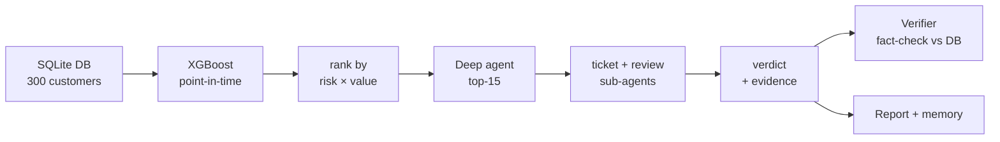

<div align="center">

# 🚨 Customer Churn Early-Warning Agent

### An XGBoost model predicts *who* will stop ordering in the next 14 days. An LLM multi-agent investigates *why* — and every claim is checked against the database.

Built to prove a point: **measure everything, including the techniques that fail.**

[](https://github.com/Khatalahmed/customer_churn_alert_agent/actions)


<table>
<tr>
<td align="center"><b>0.71</b><br><sub>ROC-AUC<br><i>out-of-time, 14 days ahead</i></sub></td>
<td align="center"><b>0.20</b><br><sub>precision<br><i>agent verdicts</i></sub></td>
<td align="center"><b>100%</b><br><sub>evidence<br><i>fidelity</i></sub></td>
<td align="center"><b>~270k</b><br><sub>tokens<br><i>per scan</i></sub></td>
</tr>
</table>

<sub>AUC is reproducible and checked in CI. Agent metrics are from one live run on
<code>gpt-6-astra</code> (Azure OpenAI) against the frozen dataset. See
[Agent metrics](#agent-metrics).</sub>

</div>

---

## The problem

On quick-commerce apps, your best customers leave **without a word**. They ordered a dozen
times, left 5-star reviews — then just stopped, and switched to a rival app.

Nobody filed a complaint. **But the data changed first:** cancelled orders, unresolved
tickets, ratings dropping, logins fading. Catch that early and a coupon still works. Catch it
late and they're gone. This system does the catching, the ranking, and the explaining.

---

## The idea: a two-stage triage funnel

Cheap ML scores everyone. Expensive AI investigates only the few that matter.

| Stage | Engine | Cost | Covers |
|---|---|---|---|
| **1 · Predict** | XGBoost model | ~free | **every active** customer (~220) |
| **2 · Investigate** | LLM deep agent + 3 sub-agents | ~270k tokens/scan | **top 15** by risk × value |

The agent **checks** the model rather than trusting it: it downgrades a "high risk" flag when
the tickets and reviews don't back it up. On the latest shortlist it dropped 5 of 15 customers
to LOW — 4 rightly, 1 a real churner it talked itself out of (see
[Agent metrics](#agent-metrics)).


```mermaid
flowchart LR
    A[SQLite DB<br/>300 customers] --> B[XGBoost<br/>point-in-time]
    B --> C[rank by<br/>risk × value]
    C --> D[Deep agent<br/>top-15]
    D --> E[ticket + review<br/>sub-agents]
    E --> F[verdict<br/>+ evidence]
    F --> G[Verifier<br/>fact-check vs DB]
    F --> H[Report + memory]
```

---

## What it produces

One command → an evidence-backed retention worklist (real output, `gpt-6-astra`):

```text
[HIGH  ] user   6 Priya Nair    prob=0.91 -> retention call
  reason: Both signals are present: an open missing-items ticket establishes
          dissatisfaction despite a 5-star review, and logins fell from 13 to 2,
          showing disengagement.

[LOW   ] user 291 Kavya Menon   prob=0.60 -> ignore
  reason: Neither signal is present: no tickets or reviews establish dissatisfaction,
          and logins increased from 0 to 1 rather than showing disengagement.
```

Then it **grades itself** — no guessing:

```text
Precision (agent)  : 0.20     (2 of 10 escalations churned in the next 14 days)
Evidence fidelity  : 100%     (75/75 cited facts matched the database)
Uplift method check: a hold-out test recovers the planted coupon effect (+31 pts)
                     on average, but one test on 78 churners ranges +14 to +47 pts
```

### Agent metrics

Measured in one live run on **`gpt-6-astra` via Azure OpenAI** (Responses API, keyless
Entra ID auth) against the frozen dataset, analysis time 2026-08-04:

| Metric | Result |
|---|---|
| Precision (agent verdicts) | **0.20** — 2 of 10 flagged customers churned within 14 days |
| Recall | 0.12 — 2 of the 16 churners; only 15 customers are investigated per scan |
| Evidence fidelity | **100%** — all 75 cited numbers matched the database |
| Tokens per scan | 264,087 in / 8,333 out |

**What the agent changed.** It downgraded 5 of the 15 to LOW: 4 correctly, and 1 (user 173)
was a real churner it argued away because logins had risen. Precision therefore stayed level
with the shortlist it was given (0.20), while recall fell from 3 to 2. A tightened rubric —
HIGH needs *both* an unresolved complaint and falling logins — is what made it willing to say
LOW at all; before that it flagged every customer it looked at.

**What the shortlist actually contained.** Of the 15 customers ranked highest: 3 churn in the
next 14 days, **4 had already churned** before the cutoff (quiet for under 28 days, so still
counted as active — the model spotted them, just late), and 8 never churn. The strict label
counts those 4 as false alarms; a retention team would still want to call them.

These numbers need a live LLM call, so CI does **not** regenerate them, and LLM output varies
between runs. To refresh them:

```bash
uv run python -m churn.main       # needs an LLM provider in .env (~45 model calls)
uv run python -m churn.eval       # precision / recall
uv run python -m churn.verifier   # evidence fidelity
```

The uplift line is simulated from the answer key and *is* reproducible.

---

## Results

### Predicting the future is much harder than recognising the past

The first version of the model labelled customers who had **already** stopped ordering and
used their whole history — so it was *detecting* past churn, not warning about future churn.
It is now built on **point-in-time snapshots**: at a cutoff date the model sees only data from
before that date and predicts who stops being active in the **next 14 days**. It trains on
three earlier snapshots and is tested on a later one it never saw.

| | Detecting past churn (v1) | Predicting the next 14 days (now) |
|---|---|---|
| ROC-AUC | 0.73 (random split) | **0.71** out-of-time · 0.63 ± 0.08 grouped CV |
| Churn rate in the scored group | 26% | 7.3% |
| Precision of the top 15 by probability | ≈ 0.80 | **0.27** — 3.7× random |
| Precision of the agent's shortlist (probability × value) | 0.80 | **0.20** — 2.8× random |


Real early warning is clearly better than random — but only 3–4 of the 15 highest-risk
customers actually churn. A test guarantees the setup: deleting every row dated after the
cutoff changes **no** feature value, and each churn event is labelled exactly once.

### Per archetype (held-out snapshot)

The simulator plants five customer types: two really churn, two are **traps** that only
*look* like churners (a vacationer goes quiet, a loyal bulk-buyer orders rarely).

| Archetype | Active | Churn in 14 days | Flagged churners | False alarms | In top 15 |
|---|---|---|---|---|---|
| cliff-dropper | 10 | 10 | 1 / 10 | – | 2 |
| gradual-fader | 6 | 6 | 2 / 6 | – | 2 |
| vacationer (trap) | 22 | 0 | – | 2 / 22 (9%) | 2 |
| loyal bulk-buyer (trap) | 22 | 0 | – | 2 / 22 (9%) | 2 |
| regular | 160 | 0 | – | 6 / 160 (4%) | 7 |

- **Cliff-droppers give almost no warning** — they stop abruptly, with no drop in activity
  beforehand. Faders taper first, so they are easier to see coming.
- **Traps are flagged about twice as often as regular customers** (9% vs 4%).
- Counts are small (16 churners in one snapshot): read these as directions, not rates.

### What the model relies on


Experience-quality rates (tickets per order, unresolved-ticket rate, cancellation rate) still
lead. Recent engagement — logins and orders in the last weeks, days since the last one — now
contributes too. In v1 those features would have leaked the label; with a future label they
are exactly the early-warning signals a retention team would see.

<sub>*Numbers are exactly reproducible: the simulator uses a fixed seed and a frozen reference
time (2026-09-01 12:00 IST) stored in the database, so every regeneration gives the same data
and the same model.*</sub>

---

## The honest engineering (what makes this more than a tutorial)

Every decision below was **measured, not assumed**:

| Decision | Why — with the evidence |
|---|---|
| ⏳ **Point-in-time labels** | v1 labelled customers who had *already* left, so recency features faked ~0.99 AUC and even the "honest" 0.73 model was detecting the past. Now features use only data before a cutoff and the label is churn in the *next* 14 days, tested on a later snapshot: AUC **0.71**, precision@15 **0.27**. Weaker — and true. |
| 🔬 **SHAP-tested features** | (v1) Dropped `tenure_days` (removing it held AUC → overfit noise); kept `avg_order_value` (removing it dropped AUC 0.73→0.66 → real signal). |
| ⚖️ **Rates, not counts** | Raw ticket count was *reversed* — churned users left early, so had *fewer* events. Rates kill the confound. |
| ❌ **A critic agent I removed** | Added a skeptical reviewer, **measured it, and it hurt** — it downgraded real churners on an already-clean shortlist. Kept as a documented negative result. |
| 🔁 **Provider = config** | One factory swaps Vertex AI / Groq / Gemini via an env var. (Found Groq's Llama-70B emits tool calls the harness rejects; Gemini doesn't.) |
| 🔒 **Least-privilege + PII** | Read-only DB; tools never return phone/email; a redaction middleware scrubs any leak before the LLM. |
| 🎯 **Uplift as a method check** | The coupon effect is *simulated*, so its size is known by construction — reporting it as a result would be circular. Instead `uplift.py` checks that a hold-out test **recovers** the planted effect, and shows how noisy one test is (±17 pts at n=78). |
| 🛠 **Production-ready** | Dockerised · LangSmith-traced · token usage tracked per scan · keyless Azure OpenAI auth · pytest + GitHub Actions CI. |

---

## Considered and rejected

Knowing what *not* to build is half the design:

| Rejected | Why |
|---|---|
| **RAG** | Structured data → retrieval is SQL. No corpus to embed. |
| **Knowledge graph** | Relationships are one FK hop; SQL answers everything. |
| **Kubernetes** | A weekly batch job on one SQLite file — a container is right-sized. |
| **Fine-tuning** | No data volume, no measured prompting failure. |
| **Fancy UI / live dashboard** | The product is decision quality — the metrics and the report. |

---

## Project structure

```text
churn/                     # source package
├── quick_commerce_sim.py  #   synthetic data (causal churn + archetypes) + answer key
├── features.py            #   point-in-time snapshots + future (14-day) labels
├── train_model.py         #   XGBoost, grouped CV + out-of-time test
├── scoring.py             #   risk × value priority tool
├── main.py                #   the deep agent (3 sub-agents)
├── eval.py / verifier.py  #   precision-recall + evidence fact-checking
├── explain.py             #   SHAP
├── archetype_eval.py      #   per-type recall + trap false-alarms
├── critic.py              #   the measured negative result
├── uplift.py / drift.py   #   hold-out uplift + PSI drift
├── pii.py / memory.py     #   redaction middleware + no re-nagging
tests/  ·  docs/  ·  scripts/  ·  Dockerfile  ·  .github/
```

📖 **New here?** Read [`docs/PROJECT_GUIDE.md`](docs/PROJECT_GUIDE.md) (the plan) then
[`docs/BUILD_JOURNEY.md`](docs/BUILD_JOURNEY.md) (built stage by stage).

---

## Running it

```bash
uv sync                                        # install
# add a .env, e.g.  MODEL_PROVIDER=groq  MODEL_NAME=llama-3.3-70b-versatile  GROQ_API_KEY=...
# optional: MODEL_PRICE_IN_PER_M / MODEL_PRICE_OUT_PER_M (USD per 1M tokens) for the run-cost estimate
# optional: CHURN_DATA_DIR=... to keep the DB, model and outputs outside the repo

uv run python -m churn.quick_commerce_sim init # 1. build data + answer key
uv run python -m churn.train_model             # 2. train the model
uv run python -m churn.main                    # 3. run the agent

uv run python -m churn.eval                    # precision / recall
uv run python -m churn.verifier                # evidence fidelity
uv run python -m churn.archetype_eval          # per-archetype performance
uv run python -m churn.report                  # retention worklist
```

Or with Docker (data + model baked in, no API key for the ML demo):

```bash
docker build -t churn-agent . && docker run --rm churn-agent uv run python -m churn.explain
```

---

## Limitations

- **Synthetic data** — no real users. Results are framed as engineering + eval quality, never business impact.
- **Frozen clock** — the data lives at a fixed reference time (stored in the DB, used by every time-window query) so results are reproducible. `quick_commerce_sim init --now wallclock` restores live timing, at the cost of reproducibility.
- **Small sample** — 38 churn events to train on and 16 in the test snapshot, so AUC swings between 0.49 and 0.73 across CV folds. Treat every number as a direction, not a precise rate.
- **Evaluated in the past** — the pipeline runs "as of" the test cutoff (2026-08-04) so its 14-day outcome can be checked. `CHURN_AS_OF=reference` scores the latest data instead, where no outcome is known yet.
- **Not million-scale** — per-customer LLM investigation suits top-N triage; the ML layer keeps the agent's workload bounded.

---

<div align="center">
<sub>A hands-on study of the ML + agent hybrid pattern — prediction, tool-using agents, structured output,<br>
evaluation against ground truth, explainability, and the honest measurement of <b>every</b> technique.</sub>
</div>
