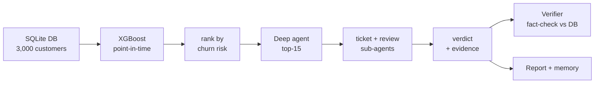

<div align="center">

# 🚨 Customer Churn Early-Warning Agent

### An XGBoost model predicts *who* will stop ordering in the next 14 days. An LLM multi-agent investigates *why* — and every claim is checked against the database.

Built to prove a point: **measure everything, including the techniques that fail.**

[](https://github.com/Khatalahmed/customer_churn_alert_agent/actions)


<table>
<tr>
<td align="center"><b>0.83</b><br><sub>ROC-AUC<br><i>out-of-time, 14 days ahead</i></sub></td>
<td align="center"><b>9.5x</b><br><sub>better than random<br><i>@ top-15</i></sub></td>
<td align="center"><b>100%</b><br><sub>evidence<br><i>fidelity</i></sub></td>
<td align="center"><b>~276k</b><br><sub>tokens<br><i>per scan</i></sub></td>
</tr>
</table>

<sub>Model numbers are reproducible and checked in CI. Agent numbers come from one live
<code>gpt-6-astra</code> (Azure OpenAI) run on this same dataset — see
[Agent metrics](#agent-metrics).</sub>

</div>

---

## The problem

On quick-commerce apps, your best customers leave **without a word**. They ordered a dozen
times, left 5-star reviews — then just stopped, and switched to a rival app.

Nobody filed a complaint. **But the data changed first:** cancelled orders, unresolved
tickets, ratings dropping, logins fading. Catch that early and a coupon still works. Catch it
late and they're gone. This system does the catching, the ranking, and the explaining.

---

## The idea: a two-stage triage funnel

Cheap ML scores everyone. Expensive AI investigates only the few that matter.

| Stage | Engine | Cost | Covers |
|---|---|---|---|
| **1 · Predict** | XGBoost model | ~free | **every active** customer (~2,500) |
| **2 · Investigate** | LLM deep agent + 3 sub-agents | ~270k tokens/scan | **top 15** by churn risk |

The agent **checks** the model rather than trusting it: it downgrades a flag when the tickets
and reviews don't back it up. On the latest run it issued **no HIGH verdicts at all** — 14
MEDIUM and one LOW — because its rubric needs *both* an unresolved complaint and falling
logins, and almost every shortlisted customer had complaints while still logging in (see
[Agent metrics](#agent-metrics)).


```mermaid
flowchart LR
    A[SQLite DB<br/>3,000 customers] --> B[XGBoost<br/>point-in-time]
    B --> C[rank by<br/>churn risk]
    C --> D[Deep agent<br/>top-15]
    D --> E[ticket + review<br/>sub-agents]
    E --> F[verdict<br/>+ evidence]
    F --> G[Verifier<br/>fact-check vs DB]
    F --> H[Report + memory]
```

---

## What it produces

One command → an evidence-backed retention worklist (real output, `gpt-6-astra`):

```text
[MEDIUM] user 1908 Ananya Nair  prob=0.92 -> retention call
  reason: Dissatisfaction: unresolved delivery, payment, and refund issues, plus
          2-star reviews about quality and leaking packaging. No disengagement:
          logins rose from 0 to 17, supporting MEDIUM rather than HIGH.

[LOW   ] user  726 Tara Gupta   prob=0.89 -> ignore
  reason: No dissatisfaction: the unresolved ticket is a general account question,
          the quality complaint is closed, and the review is 3 stars. No
          disengagement: logins rose from 0 to 8. Neither signal supports the high
          ML probability.
```

Then it **grades itself** — no guessing:

```text
Precision (agent)  : 0.14     (2 of 14 escalations churned in the next 14 days)
Evidence fidelity  : 100%     (75/75 cited facts matched the database)
Uplift method check: a hold-out test recovers the planted coupon effect (+31 pts)
                     on average, but one test on 78 churners ranges +14 to +47 pts
```

### Agent metrics

Measured in one live run on **`gpt-6-astra` via Azure OpenAI** (Responses API, keyless
Entra ID auth) against this dataset, analysis time 2026-08-04, ~2 minutes:

| Metric | Result |
|---|---|
| Precision (agent verdicts) | **0.14** — 2 of 14 flagged customers churned within 14 days |
| Recall | 0.06 — 2 of the 35 churners; only 15 customers are investigated per scan |
| Evidence fidelity | **100%** — all 75 cited numbers matched the database |
| Tokens per scan | 266,938 in / 9,287 out |

**The agent stopped shouting.** It returned **no HIGH verdicts** — 14 MEDIUM and one LOW.
Its rubric requires *both* an unresolved complaint and falling logins for HIGH, and nearly
every shortlisted customer had complaints while still logging in (one had risen from 0 to 17
logins). An earlier, looser prompt flagged all 15 as HIGH; this one says "worth a call, but
they haven't disengaged yet", which is a more useful thing to tell a retention team.

**It did not improve precision.** 0.14 against the shortlist's 0.13 — the investigation adds
evidence and explanations rather than filtering. On the previous dataset it also talked itself
out of one real churner. That is the honest state of this hybrid: the ML layer decides *who*,
and the agent explains *why*.

**What the shortlist contained.** Of 2,561 customers scored, 74 had already churned before the
cutoff — the model often ranks them highly (correctly, just late), but the strict label counts
them as false alarms.

These numbers need a live LLM call, so CI does **not** regenerate them, and LLM output varies
between runs. To refresh them:

```bash
uv run python -m churn.main       # needs an LLM provider in .env (~45 model calls)
uv run python -m churn.eval       # precision / recall
uv run python -m churn.verifier   # evidence fidelity
```

The uplift line is simulated from the answer key and *is* reproducible.

---

## Results

### Predicting the future is much harder than recognising the past

The first version labelled customers who had **already** stopped ordering and used their whole
history — so it *detected* past churn rather than warning about it. It is now built on
**point-in-time snapshots**: at a cutoff date the model sees only data from before that date
and predicts who stops being active in the **next 14 days**. It trains on ten earlier
snapshots and is tested on a later one it never saw.

| | Detecting past churn (v1) | Predicting the next 14 days (now) |
|---|---|---|
| ROC-AUC | 0.73 (random split) | **0.83** out-of-time · 0.79 ± 0.03 grouped CV |
| Churn rate in the scored group | 26% | 1.4% |
| Precision of the top 15 | ≈ 0.80 | **0.13** — but **9.5× random** |

The precision *looks* worse because the question got much harder: only 35 of 2,487 active
customers churn in a given fortnight, so picking 15 at random catches 0.2 of them.


A test guarantees the setup: deleting every row dated after the cutoff changes **no** feature
value, and each churn event is labelled exactly once.

### Does the ML actually beat a simple rule?

"We used XGBoost" is not a result. `churn.baselines` scores the same held-out snapshot with
the things a team would try first:

| Method | AUC | Precision@15 | Lift |
|---|---|---|---|
| pick at random | 0.50 | 0.01 | 1.0x |
| dormancy rule (days since last order) | 0.38 | 0.00 | 0.0x |
| login drop (prev 14d − last 14d) | 0.40 | 0.00 | 0.0x |
| logistic regression | **0.83** | 0.07 | 4.7x |
| XGBoost (this project) | **0.83** | **0.13** | **9.5x** |

The classic **"no orders in 14 days" flag** picks 353 customers and catches **zero** of the 35
churners. In this world going quiet mostly means a loyal low-frequency buyer; churn is driven
by bad *experience*, not by silence — which is why both quiet-customer rules score **worse
than random**.

One snapshot is noisy, so the same comparison runs at all 10 cutoffs (train on everything
earlier):

| Method | mean AUC | mean precision@15 |
|---|---|---|
| XGBoost | 0.76 | **0.12** (5.9× random) |
| logistic regression | **0.77** | 0.10 |
| login drop rule | 0.40 | 0.04 |
| dormancy rule | 0.41 | 0.01 |

**Honest conclusion:** XGBoost and logistic regression rank equally well overall; XGBoost is
modestly better at the top of the list, which is the part the agent consumes. Both beat the
rules decisively.

### How good could *any* model be here?

Giving a model the simulator's **hidden** variables — each customer's true dissatisfaction
drivers and their exact accumulated frustration — sets the ceiling:

| | mean AUC | mean precision@15 |
|---|---|---|
| our features | 0.76 | 0.12 |
| oracle (hidden drivers) | 0.89 | **0.21** |

So precision@15 is near its limit: the quit itself is a dice roll triggered by events that
happen *after* the cutoff, and nothing observable can anticipate those. Ranking still has room.

### Things I measured that did **not** work

| Tried | Result |
|---|---|
| Rank the shortlist by risk × order value | **Cost 40% of precision** (0.073 vs 0.120): order value carries no churn signal. Risk now picks the 15; value only orders them. |
| Recent-pain features (recent cancellations, fresh unresolved tickets, low reviews) | AUC 0.69 → 0.67. The lifetime rates already carry it. |
| Smoothed rates (shrink toward the average when evidence is thin) | AUC up, top-15 precision down — not worth it |
| Deeper trees (depth 5) | precision@15 halved: textbook overfitting on 400 churn events |
| 28-day horizon ("churns this month") | lift halved; the frustration signal fades after ~2 weeks |
| 365-day history per customer | AUC 0.73 → 0.78, but top-15 lift 6.2× → 4.0× |
| More customers (1,500 → 3,000) | **Kept**: AUC 0.73 → 0.76, precision@50 4.4× → 5.2× |
| Exposure counts (orders/tickets/reviews) | **Kept**: AUC 0.69 → 0.73, and steadier (CV ±0.054 → ±0.027) |

### Per archetype (held-out snapshot)

The simulator plants five customer types: two really churn, two are **traps** that only
*look* like churners (a vacationer goes quiet, a loyal bulk-buyer orders rarely).

| Archetype | Active | Churn in 14 days | Flagged churners | False alarms |
|---|---|---|---|---|
| cliff-dropper | 18 | 18 | 7 / 18 | – |
| gradual-fader | 17 | 17 | 8 / 17 | – |
| vacationer (trap) | 238 | 0 | – | 32 / 238 (13%) |
| loyal bulk-buyer (trap) | 211 | 0 | – | 12 / 211 (6%) |
| regular | 2003 | 0 | – | 319 / 2003 (16%) |

- **The traps are no longer the weak spot.** Loyal bulk-buyers (6%) and vacationers (13%) are
  flagged *less* than regular customers (16%) — the model reads bad experience, not silence.
- **Gradual faders are caught more often than cliff-droppers** (8/17 vs 7/18): faders taper
  first, while cliff-droppers stop abruptly with no warning in the data.

### What the model relies on


Unresolved-ticket rate and recent logins lead, with `total_orders` close behind — the model
uses it to judge *how much to trust* each rate: 1 cancellation in 4 orders is a guess, 10 in
40 is a fact. Adding those exposure counts was the single change that helped most.

<sub>*Numbers are exactly reproducible: the simulator uses a fixed seed and a frozen reference
time (2026-09-01 12:00 IST) stored in the database, so every regeneration gives the same data
and the same model.*</sub>

---

## The honest engineering (what makes this more than a tutorial)

Every decision below was **measured, not assumed**:

| Decision | Why — with the evidence |
|---|---|
| ⏳ **Point-in-time labels** | v1 labelled customers who had *already* left, so recency features faked ~0.99 AUC and even the "honest" 0.73 model was detecting the past. Now features use only data before a cutoff and the label is churn in the *next* 14 days, tested on a later snapshot: AUC **0.83**, **9.5×** better than random at top-15. |
| 🎲 **A simulator that times churn** | Churn used to happen on a random date, so *who* was at risk was learnable but *when* was a coin flip. Customers now quit a few days after a run of bad experiences (measured: 2.25 bad events in the fortnight before quitting vs 0.93 normally) — cause before effect, which is what early warning needs. |
| 🎯 **Risk picks, value orders** | Ranking the shortlist by risk × order value cost **40%** of its precision, because order value carries no churn signal. Risk now chooses the 15; value only decides who gets called first. |
| 🔬 **SHAP-tested features** | (v1) Dropped `tenure_days` (removing it held AUC → overfit noise); kept `avg_order_value` (removing it dropped AUC 0.73→0.66 → real signal). |
| ⚖️ **Rates, plus exposure** | Raw counts alone were *reversed* (churned users left early, so had fewer events), so the features are rates. But rates from 4 orders are guesses: adding the counts back as *exposure* let the model judge which rates to trust — AUC 0.69 → 0.73. |
| ❌ **A critic agent I removed** | Added a skeptical reviewer, **measured it, and it hurt** — it downgraded real churners on an already-clean shortlist. Kept as a documented negative result. |
| 🔁 **Provider = config** | One factory swaps Vertex AI / Groq / Gemini via an env var. (Found Groq's Llama-70B emits tool calls the harness rejects; Gemini doesn't.) |
| 🔒 **Least-privilege + PII** | Read-only DB; tools never return phone/email; a redaction middleware scrubs any leak before the LLM. |
| 🎯 **Uplift as a method check** | The coupon effect is *simulated*, so its size is known by construction — reporting it as a result would be circular. Instead `uplift.py` checks that a hold-out test **recovers** the planted effect, and shows how noisy one test is (±17 pts at n=78). |
| 🛠 **Production-ready** | Dockerised · LangSmith-traced · token usage tracked per scan · keyless Azure OpenAI auth · pytest + GitHub Actions CI. |

---

## Considered and rejected

Knowing what *not* to build is half the design:

| Rejected | Why |
|---|---|
| **RAG** | Structured data → retrieval is SQL. No corpus to embed. |
| **Knowledge graph** | Relationships are one FK hop; SQL answers everything. |
| **Kubernetes** | A weekly batch job on one SQLite file — a container is right-sized. |
| **Fine-tuning** | No data volume, no measured prompting failure. |
| **Fancy UI / live dashboard** | The product is decision quality — the metrics and the report. |

---

## Project structure

```text
churn/                     # source package
├── quick_commerce_sim.py  #   synthetic data (causal churn + archetypes) + answer key
├── features.py            #   point-in-time snapshots + future (14-day) labels
├── train_model.py         #   XGBoost, grouped CV + out-of-time test
├── scoring.py             #   shortlist by churn risk, ordered by value at risk
├── main.py                #   the deep agent (3 sub-agents)
├── eval.py / verifier.py  #   precision-recall + evidence fact-checking
├── explain.py             #   SHAP
├── archetype_eval.py      #   per-type recall + trap false-alarms
├── baselines.py           #   rules vs logistic regression vs XGBoost
├── critic.py              #   the measured negative result
├── uplift.py / drift.py   #   hold-out uplift + PSI drift
├── pii.py / memory.py     #   redaction middleware + no re-nagging
tests/  ·  docs/  ·  scripts/  ·  Dockerfile  ·  .github/
```

📖 **New here?** Read [`docs/PROJECT_GUIDE.md`](docs/PROJECT_GUIDE.md) (the plan) then
[`docs/BUILD_JOURNEY.md`](docs/BUILD_JOURNEY.md) (built stage by stage).

---

## Running it

```bash
uv sync                                        # install
# add a .env, e.g.  MODEL_PROVIDER=groq  MODEL_NAME=llama-3.3-70b-versatile  GROQ_API_KEY=...
# optional: MODEL_PRICE_IN_PER_M / MODEL_PRICE_OUT_PER_M (USD per 1M tokens) for the run-cost estimate
# optional: CHURN_DATA_DIR=... to keep the DB, model and outputs outside the repo

uv run python -m churn.quick_commerce_sim init # 1. build data + answer key
uv run python -m churn.train_model             # 2. train the model
uv run python -m churn.main                    # 3. run the agent

uv run python -m churn.eval                    # precision / recall
uv run python -m churn.verifier                # evidence fidelity
uv run python -m churn.archetype_eval          # per-archetype performance
uv run python -m churn.baselines               # rules vs logistic regression vs XGBoost
uv run python -m churn.report                  # retention worklist
```

Or with Docker (data + model baked in, no API key for the ML demo):

```bash
docker build -t churn-agent . && docker run --rm churn-agent uv run python -m churn.explain
```

---

## Limitations

- **Synthetic data** — no real users. Results are framed as engineering + eval quality, never business impact.
- **Frozen clock** — the data lives at a fixed reference time (stored in the DB, used by every time-window query) so results are reproducible. `quick_commerce_sim init --now wallclock` restores live timing, at the cost of reproducibility.
- **Rare events** — 473 churners across 3,000 customers, but only ~35 in any single fortnight, so precision@15 moves by 7 points per customer. Walk-forward means over 10 cutoffs are the trustworthy numbers; a single snapshot is not.
- **A measured ceiling** — a model given the simulator's hidden variables reaches precision@15 of 0.21; ours is 0.12. Most of the remaining gap is irreducible: the quit is triggered by events that happen after the cutoff.
- **Evaluated in the past** — the pipeline runs "as of" the test cutoff (2026-08-04) so its 14-day outcome can be checked. `CHURN_AS_OF=reference` scores the latest data instead, where no outcome is known yet.
- **Not million-scale** — per-customer LLM investigation suits top-N triage; the ML layer keeps the agent's workload bounded.

---

<div align="center">
<sub>A hands-on study of the ML + agent hybrid pattern — prediction, tool-using agents, structured output,<br>
evaluation against ground truth, explainability, and the honest measurement of <b>every</b> technique.</sub>
</div>
