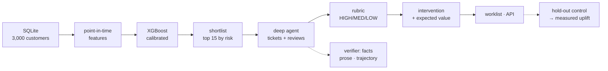
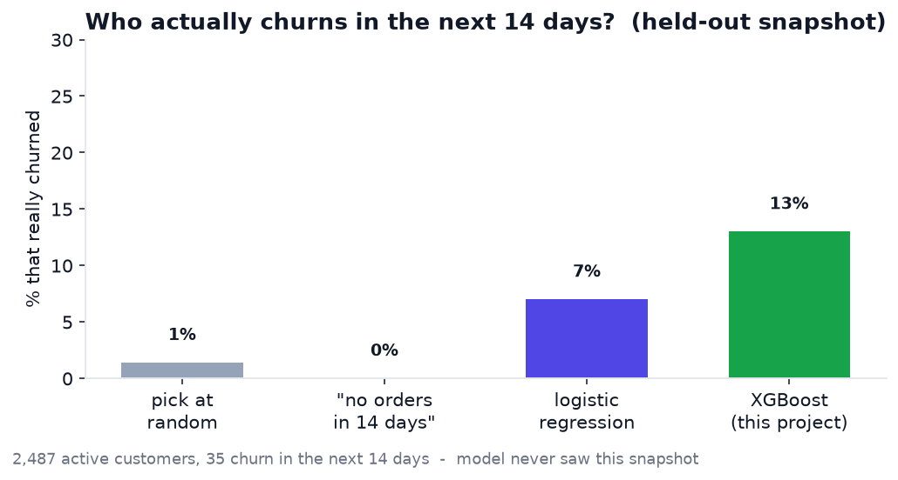
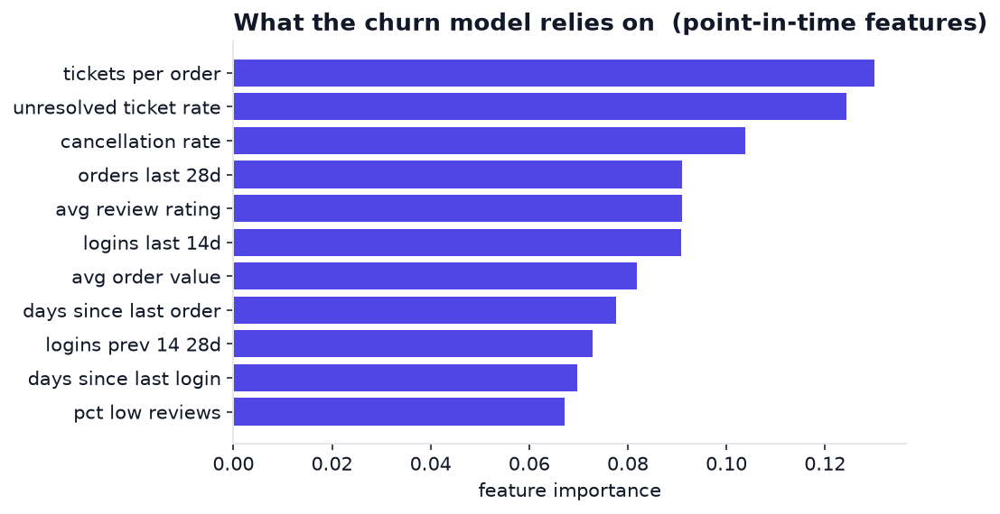

<div align="center">

# 🚨 Customer Churn Early-Warning Agent

### An XGBoost model predicts *who* will stop ordering in the next 14 days. Code decides *how urgent*. An LLM multi-agent explains *why* — and every claim is checked against the database.

Built to prove a point: **measure everything, including the techniques that fail.**

[](https://github.com/Khatalahmed/customer_churn_alert_agent/actions)


<table>
<tr>
<td align="center"><b>9.5x</b><br><sub>better than random<br><i>@ top-15</i></sub></td>
<td align="center"><b>4.9x</b><br><sub>PR-AUC<br><i>vs its floor</i></sub></td>
<td align="center"><b>100%</b><br><sub>evidence<br><i>fidelity</i></sub></td>
<td align="center"><b>9/9</b><br><sub>trajectory<br><i>rules passed</i></sub></td>
</tr>
</table>

<sub>Every model number is regenerated from scratch in CI. Agent numbers come from one live
<code>gpt-6-astra</code> (Azure OpenAI) run on this same dataset.</sub>

</div>

---

## The problem

On quick-commerce apps, your best customers leave **without a word**. They ordered a dozen
times, left 5-star reviews — then just stopped, and switched to a rival app.

Nobody filed a complaint. **But the data changed first:** cancelled orders, unresolved
tickets, ratings dropping, logins fading. Catch that early and a coupon still works. Catch it
late and they're gone.

---

## How it works

Three different things decide three different questions — and none of them does another's job.

| Question | Decided by | Why |
|---|---|---|
| **Who** is at risk? | XGBoost, calibrated | scores 2,500 customers for the price of nothing |
| **How urgent** is it? | `churn/rubric.py`, plain code | reproducible, unit-tested, free — and *measurably* as good as the LLM was |
| **Why**, in words? | LLM deep agent + 3 sub-agents | reads ticket text and reviews, which SQL cannot |
| **Is it worth doing?** | `churn/actions.py` | expected value = P(churn) × margin at risk × uplift − cost |


```mermaid
flowchart LR
    A[SQLite<br/>3,000 customers] --> B[point-in-time<br/>features]
    B --> C[XGBoost<br/>calibrated]
    C --> D[shortlist<br/>top 15 by risk]
    D --> E[deep agent<br/>tickets + reviews]
    E --> F[rubric<br/>HIGH/MED/LOW]
    F --> G[intervention<br/>+ expected value]
    G --> H[worklist · API]
    E -.-> V[verifier: facts<br/>prose · trajectory]
    H -.-> L[hold-out control<br/>→ measured uplift]
```

---

## What it produces

```text
DAILY CHURN SCAN  (analysis time 2026-08-04 06:30:00)
Scored 2561 active customers, skipped 0 contacted in the last 30 days
Worklist: 15 customers, 14 worth acting on, Rs142 expected value
  Aditya Gupta        MEDIUM    13%  automated we-miss-you email       Rs     20
  Arjun Verma         MEDIUM    14%  automated we-miss-you email       Rs     16
No alerts: inputs look like the training data.
```

Each customer arrives with the agent's reasoning, and a risk level that code — not the LLM —
assigned from facts re-queried from the database:

```text
[MEDIUM] user 1908 Ananya Nair  prob=13% -> automated we-miss-you email
  reason: Dissatisfaction: unresolved delivery, payment, and refund issues, plus
          2-star reviews about quality and leaking packaging. No disengagement:
          logins rose from 0 to 17, supporting MEDIUM rather than HIGH.

[LOW   ] user  726 Tara Gupta   prob=14% -> no action
  reason: No dissatisfaction: the unresolved ticket is a general account question,
          the quality complaint is closed, and the review is 3 stars. No
          disengagement: logins rose from 0 to 8.
```

---

## Results

### Predicting the future is much harder than recognising the past

v1 labelled customers who had **already** stopped ordering and used their whole history — it
*detected* past churn and scored ~0.80 precision. Now features come only from before a cutoff
date, the label is "stops in the next 14 days", and the test is a **later** snapshot the model
never saw. A test proves it: deleting every row dated after the cutoff changes no feature value.

Held-out snapshot: 2,487 active customers, 35 churn, a **1.4% base rate**.

| Metric | Result | Why this one |
|---|---|---|
| PR-AUC | **0.069** vs a 0.014 floor (**4.9×**) | the honest summary at a 1.4% base rate |
| ROC-AUC | 0.839 | flattering — averages over thresholds nobody uses |
| Grouped CV AUC | 0.787 ± 0.027 | a customer never spans train and validation |
| Precision@15 | **0.13 — 9.5× random** | the agent investigates exactly 15 |
| Recall@50 / @100 | 0.17 / 0.29 | what a bigger shortlist would buy |
| Brier score | 0.1020 → **0.0135** after calibration | so "13%" can be multiplied by money |



### Does the ML actually beat a simple rule?

"We used XGBoost" is a choice, not a result. `churn.baselines` scores the same snapshot with
what a team would try first:

| Method | ROC-AUC | PR-AUC | Precision@15 |
|---|---|---|---|
| pick at random | 0.50 | 0.014 | 0.01 |
| dormancy rule (days since last order) | 0.38 | 0.011 | 0.00 |
| login drop (prev 14d − last 14d) | 0.40 | 0.012 | 0.00 |
| logistic regression | 0.83 | 0.071 | 0.07 |
| XGBoost (this project) | 0.83 | **0.087** | **0.13** |

The classic **"no orders in 14 days" flag picks 353 customers and catches zero** of the 35
churners. In this world quiet usually means a loyal low-frequency buyer; churn is driven by
bad *experience*. Both quiet-customer rules score **worse than random**.

Note what PR-AUC does that ROC-AUC cannot: it separates XGBoost from logistic regression
(0.087 vs 0.071) where ROC-AUC calls them a tie at 0.83.

Over all 10 cutoffs (train on everything earlier): XGBoost mean AUC **0.76**, precision@15
**0.12**; logistic regression 0.77 / 0.10; the rules 0.40 / 0.04 and 0.41 / 0.01.

### How good could *any* model be here?

Give a model the simulator's **hidden** variables — each customer's true dissatisfaction
drivers and their exact accumulated frustration:

| | mean AUC | mean precision@15 | mean PR-AUC |
|---|---|---|---|
| our features | 0.76 | 0.12 | 0.088 |
| oracle (hidden state) | **0.90** | **0.21** | **0.173** |

Precision@15 is near its ceiling: the quit is triggered by events that happen *after* the
cutoff, and nothing observable can anticipate those. Knowing this is what stops you tuning
toward a number that does not exist.

### Per archetype (held-out snapshot, top 50 of 2,487 flagged)

| Archetype | Active | Churn in 14 days | Caught | False alarms |
|---|---|---|---|---|
| cliff-dropper | 18 | 18 | 3 / 18 | – |
| gradual-fader | 17 | 17 | 3 / 17 | – |
| vacationer (trap) | 238 | 0 | – | 4 / 238 (2%) |
| loyal bulk-buyer (trap) | 211 | 0 | – | **0 / 211 (0%)** |
| regular | 2003 | 0 | – | 40 / 2003 (2%) |

The traps are the point: a vacationer goes quiet, a loyal bulk-buyer orders rarely. The
dormancy rule flags both. This model flags **none** of the loyal buyers — it reads bad
experience, not silence.

### What the model relies on



Unresolved-ticket rate and recent logins lead, with `total_orders` close behind — the model
uses it to judge *how much to trust* each rate: 1 cancellation in 4 orders is a guess, 10 in
40 is a fact.

---

## The division of labour (and what the agent is actually worth)

The agent used to assign the risk levels. Measured, its verdicts added nothing to precision
(0.14 vs the shortlist's 0.13) — it was applying a fixed rule, with LLM variance on top. So the
rule moved into `churn/rubric.py`, and a live run confirmed the code reproduces the LLM's
verdicts **customer for customer**.

Latest live run on **`gpt-6-astra` via Azure OpenAI** (Responses API, keyless Entra ID auth):

| Metric | Result |
|---|---|
| Verdicts | 14 MEDIUM, 1 LOW — no HIGH: complaints, but customers still logging in |
| Precision | 0.07 (1 of 14) — the ML shortlist decides who; the agent explains |
| Evidence fidelity | **100%** — all 90 cited facts matched the database |
| Prose fidelity | **100%** — 77 claims extracted from the written reasons, all supported (71% of clauses yielded a checkable claim) |
| Trajectory | **9/9 rules** — ranked once, checked tickets *and* reviews for all 15, nobody off-list, no repeats, 31 calls within budget |
| Cost | 267,252 in / 8,853 out tokens, ~2 minutes |

**Trajectory evals** (`churn/trace_eval.py`) are the part most agent projects skip: precision
tells you the verdict was right, not that the agent got there properly. Every tool call is
recorded and graded against rules — did it skip the review check, investigate someone who was
never shortlisted, loop on one tool, reach for a tool it was never given?

**The prose is checked too** (`churn/prose_eval.py`). Filling a schema correctly and then
writing a sentence about a ticket that does not exist are entirely compatible, and the
sentence is the part a human reads. The reason text is split into clauses and each claim is
re-queried: ticket counts and categories with their open/closed state, star ratings, what a
complaint actually *says*, login movements, and absences ("there are no reviews"). Claims are
extracted by pattern rather than by a second LLM — a model checking a model would need its own
verifier. Eight deliberately corrupted reasons are in the test suite, one per claim type, so
the checker is proven able to fail.

---

## Is it worth doing? (the part that says no)

Calibrated probabilities can be multiplied by money, so `churn/actions.py` matches a fix to the
problem — an unresolved refund gets the ticket resolved, not a coupon — and prices it:

**expected value = P(churn) × margin at risk × uplift − cost**

| Intervention | Margin at risk needed to break even at 14% churn |
|---|---|
| win-back coupon (₹150) | ₹7,143 |
| resolve ticket + call (₹250) | ₹5,952 |
| automated email (₹5) | ₹714 |

Nobody on the shortlist has more than ~₹4,000 at risk, so **no paid intervention pays for
itself**. The plan downgrades to the near-free email — 14 of 15 customers, ₹142 total — and
reports the break-even figure that *would* justify the real fix. At a 14% probability this
shortlist justifies an automated email, not a human being's time.

<sub>Margin rate, uplift and costs are assumptions, gathered at the top of `churn/actions.py`.
The rupee figures are illustrative: they show the decision logic, not a business result.</sub>

---

## Running it like a service

| Command | What it does |
|---|---|
| `python -m churn.pipeline` | the scheduled scan: score everyone, write `worklist.json`, check drift, **exit 2 on an alert** |
| `uvicorn churn.api:app` | `/health`, `/worklist`, `/customers/{id}`, `/contacted` — no LLM in the path, so answers are deterministic |
| `python -m churn.outcomes` | log actions with a hold-out control, then measure the uplift that followed |
| `python -m churn.retrain` | backtest whether refreshing the model beats leaving it stale, and promote if so |

**Closing the loop.** 30% of the worklist is held back by a seeded random draw, because the
customers you contact are the ones most likely to leave — without a control their churn rate
looks terrible however well the coupon worked. Latest measurement: **−9% uplift,
inconclusive** (1 of 11 treated churned, 0 of 4 controls, intervals overlapping). It also says
what would settle it: **~9,500 customers per arm**. A 15-customer worklist cannot measure
retention uplift, and saying so is the point.

**Retraining is a decision, not a habit.** Backtested over the snapshots: a model trained once
and never refreshed scores PR-AUC 0.072; refreshed each period, 0.089. Refreshing wins, so it
promotes — to `churn_model_production.pkl`, never over the evaluated model, because the
production model has seen the test snapshot.

---

## The honest engineering (what makes this more than a tutorial)

Every decision below was **measured, not assumed**:

| Decision | Why — with the evidence |
|---|---|
| ⏳ **Point-in-time labels** | v1 labelled customers who had *already* left, so it detected the past at a flattering ~0.80 precision. Features now use only data from before a cutoff; a test proves deleting later rows changes nothing. |
| 🎲 **A simulator that times churn** | Churn used to happen on a random date, so *who* was learnable but *when* was a coin flip. Customers now quit days after a run of bad experiences — 2.25 bad events in the fortnight before quitting vs 0.93 normally. |
| 📉 **PR-AUC over ROC-AUC** | At a 1.4% base rate ROC-AUC says 0.84 and calls XGBoost and logistic regression identical. PR-AUC says 0.069 against a 0.014 floor, and separates them. |
| 🎯 **Calibration** | Class weighting emitted ~0.9 "probabilities" for a 1.4% event. Platt scaling: Brier 0.102 → 0.0135, ranking untouched — the prerequisite for multiplying by money. |
| 🧮 **Code decides, the LLM explains** | The agent's verdicts added nothing to precision (0.14 vs 0.13) and followed a fixed rule. Moved to `rubric.py`: reproducible, free, unit-tested — and a live run reproduced the LLM's verdicts exactly. |
| 🛤 **Trajectory evals** | Accuracy cannot see a skipped review check or a wandering agent. Nine rules over the recorded tool calls, unit-tested against hand-built broken traces. |
| 🔍 **Verified prose, not just schema** | The structured fields were checked; the sentence a human reads was not. Claims are now extracted from the free text and re-queried — counts, categories, ratings, complaint content, absences — with coverage reported so unchecked never reads as correct. |
| 🎯 **Risk picks, value orders** | Ranking the shortlist by risk × order value cost **40%** of its precision (0.073 vs 0.120): order value carries no churn signal. |
| 💸 **An ROI that says no** | No paid intervention pays for itself on this shortlist; the honest recommendation is a ₹5 email, with the break-even figure that would change that. |
| 🔒 **Least-privilege + PII** | Read-only DB; tools never return phone/email; a redaction middleware scrubs any leak before the LLM. |
| 🛠 **Production-ready** | Scheduled scan with alerting · FastAPI service · Docker · keyless Azure auth · 53 tests in GitHub Actions. |

### Things I measured that did **not** work

| Tried | Result |
|---|---|
| Rank the shortlist by risk × order value | cost 40% of precision — order value carries no churn signal |
| A critic agent to catch false alarms | downgraded real churners; removed |
| Recent-pain features (fresh complaints, recent low reviews) | AUC 0.69 → 0.67; the lifetime rates already carried it |
| Smoothed rates (shrink when evidence is thin) | AUC up, top-15 down |
| Deeper trees (depth 5) | precision@15 halved — overfitting on 400 churn events |
| A 28-day horizon ("churns this month") | lift halved; the frustration signal fades after ~2 weeks |
| A 365-day history per customer | AUC 0.73 → 0.78, but top-15 lift 6.2× → 4.0× |
| Exposure counts (orders/tickets/reviews) | **kept** — AUC 0.69 → 0.73, CV spread halved |
| 3,000 customers instead of 1,500 | **kept** — AUC 0.73 → 0.76 |

---

## Considered and rejected

| Rejected | Why |
|---|---|
| **RAG** | Structured data → retrieval is SQL. No corpus to embed. |
| **Knowledge graph** | Relationships are one FK hop; SQL answers everything. |
| **Kubernetes** | A daily batch job over one SQLite file — a container is right-sized. |
| **Fine-tuning** | No data volume, no measured prompting failure. |
| **A dashboard** | The output is a worklist a CRM consumes; a chart of 15 rows is decoration. |

---

## Project structure

```text
churn/
├── quick_commerce_sim.py  #   synthetic data: churn caused by bad experience, frozen clock
├── features.py            #   point-in-time snapshots + future (14-day) labels
├── train_model.py         #   XGBoost, grouped CV, calibration, out-of-time test
├── metrics.py             #   PR-AUC, precision/recall@K, Brier, calibration table
├── baselines.py           #   rules vs logistic regression vs XGBoost
├── scoring.py             #   shortlist by churn risk, ordered by value at risk
├── rubric.py              #   the risk decision, in code
├── actions.py             #   which intervention, and what it is worth
├── main.py                #   the deep agent (3 sub-agents) — explains, never decides
├── trace.py / trace_eval.py  # record tool calls, then grade the trajectory
├── verifier.py / prose_eval.py  # fact-check the schema · fact-check the sentences
├── eval.py                #   precision vs ground truth
├── pipeline.py / api.py   #   scheduled scan · FastAPI service
├── outcomes.py / retrain.py  # hold-out control + measured uplift · retraining policy
├── explain.py             #   SHAP
├── archetype_eval.py      #   per-type recall + trap false-alarms
├── critic.py              #   a measured negative result
├── uplift.py / drift.py   #   uplift method check + PSI drift
├── pii.py / memory.py     #   redaction middleware + no re-nagging
tests/  ·  docs/  ·  scripts/  ·  Dockerfile  ·  .github/
```

📖 **New here?** Read [`docs/PROJECT_GUIDE.md`](docs/PROJECT_GUIDE.md) (the original plan) then
[`docs/BUILD_JOURNEY.md`](docs/BUILD_JOURNEY.md) (what actually happened, including the wrong turns).

---

## Running it

```bash
uv sync
cp .env.example .env        # then fill in your provider (Azure OpenAI works keyless: az login)

uv run python -m churn.quick_commerce_sim init   # 1. build data + answer key
uv run python -m churn.train_model               # 2. train + calibrate
uv run python -m churn.pipeline                  # 3. the daily scan (no LLM, no API key)
uv run python -m churn.main                      # 4. the agent investigation (needs a provider)

uv run python -m churn.trace_eval      # did the agent behave properly?
uv run python -m churn.eval            # precision / recall vs ground truth
uv run python -m churn.verifier        # evidence fidelity (the structured facts)
uv run python -m churn.prose_eval      # prose fidelity (the sentences it wrote)
uv run python -m churn.baselines       # does the ML beat a simple rule?
uv run python -m churn.archetype_eval  # where does it fail, by customer type?
uv run python -m churn.outcomes        # hold-out control → measured uplift
uv run python -m churn.retrain         # is retraining worth it?
uv run uvicorn churn.api:app --reload  # the service
```

Or with Docker (data + model baked in, no API key for the ML demo):

```bash
docker build -t churn-agent . && docker run --rm churn-agent uv run python -m churn.pipeline
```

---

## Limitations

- **Synthetic data** — no real users. Results are framed as engineering and evaluation quality, never business impact.
- **Rare events** — 473 churners across 3,000 customers, but only ~35 in any fortnight, so precision@15 moves 7 points per customer. The walk-forward means over 10 cutoffs are the trustworthy numbers; a single snapshot is not.
- **A measured ceiling** — an oracle with the simulator's hidden state reaches precision@15 of 0.21; ours is 0.12. Most of the remaining gap is irreducible.
- **Uplift cannot be measured here** — interventions change nothing in the simulator, and the sample would need ~9,500 per arm anyway. The loop reports that honestly instead of inventing a number.
- **Evaluated in the past** — the pipeline runs "as of" 2026-08-04 so its 14-day outcome is known. `CHURN_AS_OF=reference` scores the latest data, where no outcome exists yet.
- **Prose is checked by pattern, not by comprehension.** The claim types the extractor knows cover 71% of clauses; the rest are rubric restatements ("Dissatisfaction: not established") with nothing to check. A clause nothing recognises is reported as unchecked, never as correct.

---

<div align="center">
<sub>A hands-on study of the ML + agent hybrid pattern — prediction, tool-using agents, structured output,<br>
evaluation against ground truth, trajectory evals, explainability, and the honest measurement of <b>every</b> technique.</sub>
</div>
