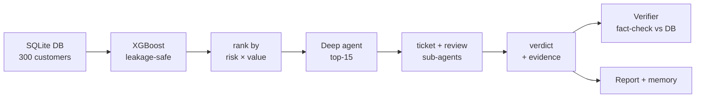
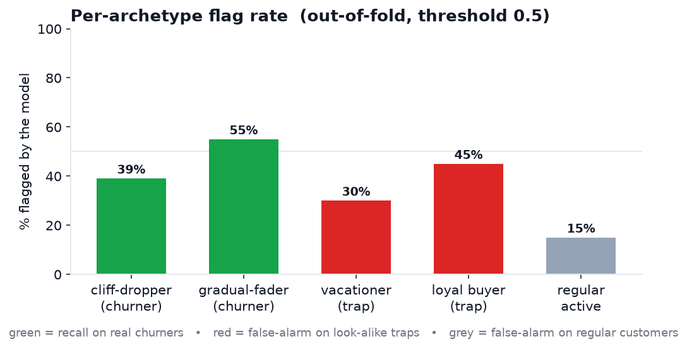

<div align="center">

# 🚨 Customer Churn Early-Warning Agent

### An XGBoost model predicts *who* is leaving. An LLM multi-agent investigates *why* — and every claim is checked against the database.

Built to prove a point: **measure everything, including the techniques that fail.**

[](https://github.com/Khatalahmed/customer_churn_alert_agent/actions)


<table>
<tr>
<td align="center"><b>0.73</b><br><sub>ROC-AUC<br><i>honest, no leakage</i></sub></td>
<td align="center"><b>0.80</b><br><sub>precision<br><i>@ top-15</i></sub></td>
<td align="center"><b>100%</b><br><sub>evidence<br><i>fidelity</i></sub></td>
<td align="center"><b>~270k</b><br><sub>tokens<br><i>per scan</i></sub></td>
</tr>
</table>

<sub>AUC is reproducible and checked in CI. Agent metrics are from one live run on
<code>gpt-6-astra</code> (Azure OpenAI) against the frozen dataset. See
[Agent metrics](#agent-metrics).</sub>

</div>

---

## The problem

On quick-commerce apps, your best customers leave **without a word**. They ordered a dozen
times, left 5-star reviews — then just stopped, and switched to a rival app.

Nobody filed a complaint. **But the data changed first:** cancelled orders, unresolved
tickets, ratings dropping, logins fading. Catch that early and a coupon still works. Catch it
late and they're gone. This system does the catching, the ranking, and the explaining.

---

## The idea: a two-stage triage funnel

Cheap ML scores everyone. Expensive AI investigates only the few that matter.

| Stage | Engine | Cost | Covers |
|---|---|---|---|
| **1 · Predict** | XGBoost model | ~free | **all 300** customers |
| **2 · Investigate** | LLM deep agent + 3 sub-agents | ~270k tokens/scan | **top 15** by risk × value |

The agent is meant to **check** the model, not just trust it: it can downgrade a "high risk"
flag when the tickets and reviews don't back it up. In the latest run it downgraded one
customer to MEDIUM but none to LOW — so on this shortlist it explained the risk rather than
filtering out the model's false alarms (see [Agent metrics](#agent-metrics)).


```mermaid
flowchart LR
    A[SQLite DB<br/>300 customers] --> B[XGBoost<br/>leakage-safe]
    B --> C[rank by<br/>risk × value]
    C --> D[Deep agent<br/>top-15]
    D --> E[ticket + review<br/>sub-agents]
    E --> F[verdict<br/>+ evidence]
    F --> G[Verifier<br/>fact-check vs DB]
    F --> H[Report + memory]
```

---

## What it produces

One command → an evidence-backed retention worklist (real output, `gpt-6-astra`):

```text
[HIGH  ] user  21 Neha Menon    prob=0.89 -> retention call
  reason: High ML probability, logins collapsing from 14 to 0, two open refund
          complaints including an urgent issue, and a 2-star leaking-package review.

[MEDIUM] user 133 Karan Gill    prob=0.98 -> retention call
  reason: Very high ML probability and logins falling from 2 to 0 warrant outreach.
          However, the review is 5 stars and the unresolved ticket is only a general
          account question, so dissatisfaction is not established.
```

Then it **grades itself** — no guessing:

```text
Precision @ top-15 : 0.80     (12 of 15 escalations were real churners)
Evidence fidelity  : 100%     (75/75 cited facts matched the database)
Uplift method check: a hold-out test recovers the planted coupon effect (+31 pts)
                     on average, but one test on 78 churners ranges +14 to +47 pts
```

### Agent metrics

Measured in one live run on **`gpt-6-astra` via Azure OpenAI** (Responses API, keyless
Entra ID auth), 2026-09-15, against the frozen dataset:

| Metric | Result |
|---|---|
| Precision @ top-15 | **0.80** — 12 of 15 flagged customers really churned |
| Recall | 0.15 — capped by design: only 15 of 78 churners can be investigated per scan |
| Evidence fidelity | **100%** — all 75 cited numbers matched the database |
| Tokens per scan | 260,948 in / 8,941 out |

**Honest finding:** the agent flagged all 15 shortlisted customers (14 HIGH, 1 MEDIUM) and
downgraded none to LOW. Its precision is therefore identical to the ML shortlist's — on this
run the investigation added evidence and explanations, not better filtering. The three false
alarms (users 104, 123, 291) had real complaints or missing reviews that the agent read as
risk.

These numbers need a live LLM call, so CI does **not** regenerate them, and LLM output varies
between runs. To refresh them:

```bash
uv run python -m churn.main       # needs an LLM provider in .env (~45 model calls)
uv run python -m churn.eval       # precision / recall
uv run python -m churn.verifier   # evidence fidelity
```

The uplift line is simulated from the answer key and *is* reproducible.

---

## Results

### Per archetype: where the model works — and where it doesn't

The simulator plants five customer types. Two really churn; two are **traps** that only
*look* dormant (people on holiday, and loyal buyers who order rarely).



Measured **out-of-fold** (5-fold CV, each customer scored by a model that never saw them;
mean over 10 fold seeds):

- **Gradual faders are caught more often than cliff-droppers** (55% vs 39% at a 0.5
  threshold). Recall at a fixed threshold is modest — the pipeline relies on *ranking*
  the top 15, not on the threshold.
- **The traps are the weak spot.** Loyal low-frequency buyers (45%) and vacationers (30%)
  are flagged at 2–3× the rate of regular customers (15%). A likely cause: they have few
  orders and reviews, so their rate features are noisy. This is exactly where the agent's
  ticket/review check has to earn its keep.

<sub>An earlier version of this section reported 88% / 91% recall and 15–20% trap
false-alarms. Those were **in-sample** (the saved model had trained on most of those
customers). `churn.archetype_eval` now prints both columns so the gap stays visible.</sub>

### It uses signals that make sense


Every feature is a **rate or average** (cancellation rate, unresolved-ticket rate, review
score) — never a raw count. Raw counts leak the answer; rates capture the *cause*.

<sub>*Numbers are exactly reproducible: the simulator uses a fixed seed and a frozen reference
time (2026-09-01 12:00 IST) stored in the database, so every regeneration gives the same data
and the same model (test AUC 0.729).*</sub>

---

## The honest engineering (what makes this more than a tutorial)

Every decision below was **measured, not assumed**:

| Decision | Why — with the evidence |
|---|---|
| 🚫 **No recency features** | They'd fake a ~0.99 AUC (they *are* the label). Rates give an honest **0.73** instead. |
| 🔬 **SHAP-tested features** | Dropped `tenure_days` (removing it held AUC → overfit noise); kept `avg_order_value` (removing it dropped AUC 0.73→0.66 → real signal). |
| ⚖️ **Rates, not counts** | Raw ticket count was *reversed* — churned users left early, so had *fewer* events. Rates kill the confound. |
| ❌ **A critic agent I removed** | Added a skeptical reviewer, **measured it, and it hurt** — it downgraded real churners on an already-clean shortlist. Kept as a documented negative result. |
| 🔁 **Provider = config** | One factory swaps Vertex AI / Groq / Gemini via an env var. (Found Groq's Llama-70B emits tool calls the harness rejects; Gemini doesn't.) |
| 🔒 **Least-privilege + PII** | Read-only DB; tools never return phone/email; a redaction middleware scrubs any leak before the LLM. |
| 🎯 **Uplift as a method check** | The coupon effect is *simulated*, so its size is known by construction — reporting it as a result would be circular. Instead `uplift.py` checks that a hold-out test **recovers** the planted effect, and shows how noisy one test is (±17 pts at n=78). |
| 🛠 **Production-ready** | Dockerised · LangSmith-traced · token usage tracked per scan · keyless Azure OpenAI auth · pytest + GitHub Actions CI. |

---

## Considered and rejected

Knowing what *not* to build is half the design:

| Rejected | Why |
|---|---|
| **RAG** | Structured data → retrieval is SQL. No corpus to embed. |
| **Knowledge graph** | Relationships are one FK hop; SQL answers everything. |
| **Kubernetes** | A weekly batch job on one SQLite file — a container is right-sized. |
| **Fine-tuning** | No data volume, no measured prompting failure. |
| **Fancy UI / live dashboard** | The product is decision quality — the metrics and the report. |

---

## Project structure

```text
churn/                     # source package
├── quick_commerce_sim.py  #   synthetic data (causal churn + archetypes) + answer key
├── features.py            #   leakage-safe feature table
├── train_model.py         #   XGBoost + honest eval
├── scoring.py             #   risk × value priority tool
├── main.py                #   the deep agent (3 sub-agents)
├── eval.py / verifier.py  #   precision-recall + evidence fact-checking
├── explain.py             #   SHAP
├── archetype_eval.py      #   per-type recall + trap false-alarms
├── critic.py              #   the measured negative result
├── uplift.py / drift.py   #   hold-out uplift + PSI drift
├── pii.py / memory.py     #   redaction middleware + no re-nagging
tests/  ·  docs/  ·  scripts/  ·  Dockerfile  ·  .github/
```

📖 **New here?** Read [`docs/PROJECT_GUIDE.md`](docs/PROJECT_GUIDE.md) (the plan) then
[`docs/BUILD_JOURNEY.md`](docs/BUILD_JOURNEY.md) (built stage by stage).

---

## Running it

```bash
uv sync                                        # install
# add a .env, e.g.  MODEL_PROVIDER=groq  MODEL_NAME=llama-3.3-70b-versatile  GROQ_API_KEY=...
# optional: MODEL_PRICE_IN_PER_M / MODEL_PRICE_OUT_PER_M (USD per 1M tokens) for the run-cost estimate
# optional: CHURN_DATA_DIR=... to keep the DB, model and outputs outside the repo

uv run python -m churn.quick_commerce_sim init # 1. build data + answer key
uv run python -m churn.train_model             # 2. train the model
uv run python -m churn.main                    # 3. run the agent

uv run python -m churn.eval                    # precision / recall
uv run python -m churn.verifier                # evidence fidelity
uv run python -m churn.archetype_eval          # per-archetype performance
uv run python -m churn.report                  # retention worklist
```

Or with Docker (data + model baked in, no API key for the ML demo):

```bash
docker build -t churn-agent . && docker run --rm churn-agent uv run python -m churn.explain
```

---

## Limitations

- **Synthetic data** — no real users. Results are framed as engineering + eval quality, never business impact.
- **Frozen clock** — the data lives at a fixed reference time (stored in the DB, used by every time-window query) so results are reproducible. `quick_commerce_sim init --now wallclock` restores live timing, at the cost of reproducibility.
- **Not million-scale** — per-customer LLM investigation suits top-N triage; the ML layer keeps the agent's workload bounded.

---

<div align="center">
<sub>A hands-on study of the ML + agent hybrid pattern — prediction, tool-using agents, structured output,<br>
evaluation against ground truth, explainability, and the honest measurement of <b>every</b> technique.</sub>
</div>
